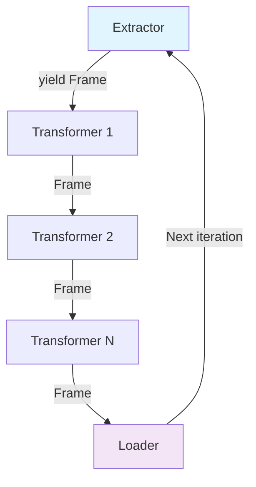

# Hoe de EtlPipe Werkt - Technische Architectuur

Deze gids legt uit hoe de EtlPipe onder de motorkap werkt. Na het lezen begrijp je precies hoe data door de pipeline stroomt en waarom bepaalde ontwerpkeuzes zijn gemaakt.

## Kernprincipe: Streaming Pipeline

De EtlPipe gebruikt een **streaming architecture** - dit betekent dat data record-voor-record wordt verwerkt in plaats van alles in één keer in het geheugen te laden.

### Waarom Streaming?

```php
// ❌ Traditionele aanpak - alles in geheugen
$data = json_decode(file_get_contents('huge-file.json'), true); // 2GB in RAM!
foreach ($data as $row) {
    // Process...
}

// ✅ EtlPipe aanpak - streaming
foreach ($extractor->extract() as $frame) { // Slechts 1 record in RAM
    // Process...
}
```

**Voordelen:**
- Constant geheugenverbruik ongeacht bestandsgrootte
- Kan bestanden verwerken die groter zijn dan beschikbaar RAM
- Begint direct met verwerken (geen wachttijd voor laden)

## De Drie Kerncomponenten

### 1. EtlPipe - De Dirigent (`src/EtlPipe.php`)

```php
EtlPipe::make()
    ->extract($extractor)    // Wat
    ->transform($transformers) // Hoe  
    ->load($loader)          // Waar
    ->run();                 // Doen!
```

**Rol:** Bouwt de pipeline op met een fluent interface, maar doet zelf geen data-verwerking.

### 2. Frame - De Datacontainer (`src/Frame.php`)

Het Frame object is het hart van de pipeline. Elke entiteit/record wordt verpakt in een Frame:

```php
final class Frame 
{
    public Collection $header;    // Kolomnamen ['name', 'email', 'age']
    public Collection $data;      // Rij data ['John', 'john@example.com', 30]
    public array $attributes;     // Metadata ['table' => 'users', 'source' => 'csv']
    public bool $end = false;     // Stream eindmarker
}
```

**Belangrijke eigenschappen:**
- Combineert automatisch header + data tot associatieve array
- Gebruikt Laravel Collections voor data-manipulatie
- Attributes voor metadata tussen pipeline-stappen
- End-flag voor proper resource cleanup

### 3. Processor - De Uitvoerder (`src/Processor.php`)

```php
public function process(): void
{
    $line = $this->extractor->extract(); // Generator krijgen
    
    foreach ($line as $frame) {          // Per Frame itereren
        $transformed = $this->pipeline->process($frame); // Transformeren
        $this->loader->load($transformed);               // Laden
    }
}
```

**Rol:** Orchstreert de daadwerkelijke ETL-verwerking met League Pipeline.

## Data Flow - Stap voor Stap

### Stap 1: Extractie (1 Frame per record)

```php
// CsvExtractor
foreach ($rowIterator as $row) {
    yield $this->frame->setData($this->makeRow($row->getCells()));
}

// SqlExtractor  
foreach ($db->cursor() as $item) {
    yield $this->frame->setData((array) $item);
}
```

**Belangrijke punten:**
- Elke extractor `yield`t **één Frame per record**
- Gebruikt PHP Generators voor memory-efficiency
- Geen batching op extractie-niveau

### Stap 2: Transformatie (1 Frame in, 1 Frame uit)

```php
// Transformer interface
public function __invoke(Frame $frame): Frame

// Voorbeeld: TrimTransformer
public function __invoke(Frame $frame): Frame
{
    $frame->data->transform(fn($item) => trim($item));
    return $frame;
}
```

**Belangrijke punten:**
- Elke transformer krijgt precies **1 Frame**
- Modificeert de `$data` Collection binnen het Frame
- Geeft hetzelfde Frame (getransformeerd) terug
- Transformers kunnen worden geketend

### Stap 3: Laden (1 Frame per aanroep)

```php
// Loader interface
public function load(Frame $frame): void

// Processor roept aan:
$this->loader->load($transformed); // 1 Frame per call
```

**Belangrijke punten:**
- Loader krijgt **1 Frame per `load()` aanroep**
- Interne buffering mogelijk (bijv. JsonLoader buffert 1000 records)
- End-frame voor cleanup (`$frame->end === true`)

## Complete Uitvoeringsflow



### Voorbeeld: 1000 CSV-rijen verwerken

1. **CsvExtractor** leest rij 1 → maakt Frame 1 → `yield`
2. **Transformers** verwerken Frame 1 sequentieel  
3. **Loader** ontvangt Frame 1 → verwerkt/buffert
4. **Herhaal** voor rij 2, 3, ..., 1000
5. **End-frame** → Loader finaliseert output

**Belangrijk:** De hele pipeline wordt 1000x uitgevoerd (1x per record), niet 1x voor alle records.

## Frame Object in Detail

### Data Combinatie

```php
// Frame setup
$frame = new Frame();
$frame->header = collect(['name', 'email', 'age']);
$frame->setData(['John', 'john@example.com', 30]);

// Automatische combinatie:
echo $frame->data; // Collection: ['name' => 'John', 'email' => 'john@example.com', 'age' => 30]
```

### Metadata met Attributes

```php
// In een transformer
$frame->setAttribute(['table' => 'users']);
$frame->setAttribute(['source_file' => 'import.csv']);

// Later gebruiken
if ($frame->attributes['table'] === 'users') {
    // Specifieke logic voor users tabel
}
```

### Stream Beëindiging

```php
// Extractor signaleert einde
$endFrame = new Frame();
$endFrame->setEnd();
yield $endFrame;

// Loader detecteert einde
public function load(Frame $frame): void 
{
    if ($frame->getEnd()) {
        $this->finalize(); // Bestanden sluiten, buffers legen, etc.
        return;
    }
    
    // Normale verwerking...
}
```

## Wat Kan in Frame::data?

Frame::data is getypeerd als `Collection<int,mixed>`, dus technisch kan alles erin:

### ✅ Werkt Goed

```php
// Scalar waarden (ideaal)
$frame->setData(['name' => 'John', 'age' => 30, 'active' => true]);

// DateTime objecten  
$frame->setData(['created_at' => new DateTime()]);

// Arrays
$frame->setData(['tags' => ['php', 'laravel']]);
```

### ⚠️ Mogelijk maar Beperkt

```php
// Custom objecten
$user = new User('John');
$frame->setData(['user' => $user]);

// Waarschuwingen:
// - JsonLoader: moet JSON-serializable zijn (implement JsonSerializable)
// - CsvLoader: verwacht alleen scalars + DateTime
// - SqlLoader: moet database-compatible zijn
```

### 💡 Beste Praktijk

Voor custom objecten, converteer naar arrays in een transformer:

```php
class UserToArrayTransformer implements TransformerInterface
{
    public function __invoke(Frame $frame): Frame
    {
        if ($frame->data->has('user')) {
            $user = $frame->data->get('user');
            $frame->data->put('user', [
                'id' => $user->getId(),
                'name' => $user->getName(),
                'email' => $user->getEmail()
            ]);
        }
        
        return $frame;
    }
}
```

## Performance Karakteristieken

### Memory Usage

```php
// Constant geheugen ongeacht bestandsgrootte
$memory_start = memory_get_usage();

EtlPipe::make()
    ->extract(CsvExtractor::make('10GB-file.csv')) // Slechts 1 rij in geheugen
    ->load(JsonLoader::make('output.json'))
    ->run();

$memory_end = memory_get_usage();  
echo $memory_end - $memory_start; // ~Constant (enkele MB's)
```

### Throughput Optimalisatie

Loaders implementeren vaak interne buffering:

```php
// JsonLoader buffert standaard 1000 records
JsonLoader::make('output.json')->setBufferSize(5000); // Meer buffering = minder I/O

// SqlLoader batch standaard 500 records  
SqlLoader::make()->setChunkSize(2000); // Grotere batches = betere performance
```

## Ontwerpkeuzes en Rationale

### Waarom Generators?

```php
// ❌ Return array - alles in geheugen
public function extract(): array 

// ✅ Generator - lazy evaluation
public function extract(): Generator
```

Generators maken het mogelijk om oneindig grote datasets te verwerken met constante memory footprint.

### Waarom 1 Frame per keer?

```php
// ❌ Batch processing - complexe memory management
public function load(array $frames): void

// ✅ Single Frame - voorspelbaar geheugenverbruik  
public function load(Frame $frame): void
```

Vereenvoudigt de architectuur en garandeert voorspelbare performance.

### Waarom Laravel Collections?

```php
// Frame::data is altijd een Collection
$frame->data->map(...)->filter(...)->groupBy(...);
```

Biedt rijke data-manipulatie API en consistente interface.

## Conclusie

De EtlPipe-architectuur is ontworpen rond drie kernprincipes:

1. **Streaming**: Record-voor-record verwerking voor geheugen-efficiency
2. **Eenvoud**: Voorspelbare interfaces en data flow  
3. **Flexibiliteit**: Modulaire componenten die uitwisselbaar zijn

Deze aanpak maakt het mogelijk om zowel kleine datasets als multi-gigabyte bestanden te verwerken met dezelfde codebase en voorspelbare performance karakteristieken.